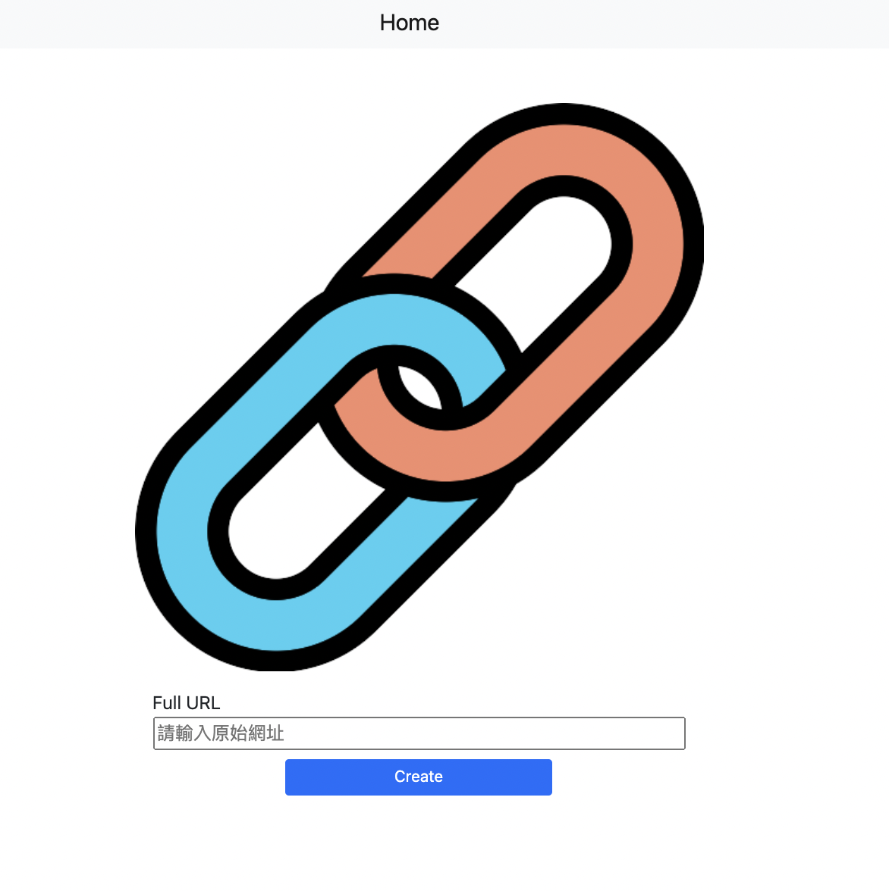
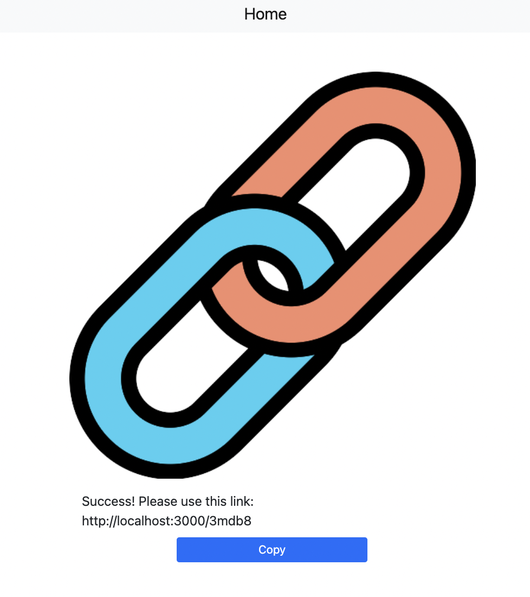

# eruc1117-ac_shortURL_V1.1

將網址轉為短網址，在伺服器運作期間可以導向原始頁面

### Function list
-將網址轉為短網址
-點擊copy按鈕可以複製短網址
-點擊home鍵可以回到創建短網址頁面

### Installing
需要下列環境

```
"node.js"
"express": "^4.17.2",
"express-handlebars": "^3.0.0"
"mongoose": "^5.9.7"
MongoDB
```
開啟終端機(Terminal)，cd到存放專案本機位置並執行
```
git clone https://github.com/eruc1117/eruc1117-ac_shortURL_V1.1.git
```
下載專案後再次cd到eruc1117-ac_shortURL_V1.1，再往下進行
express 安裝步驟
```
npm init -y
```
```
npm i express
```
安裝 express handlebars
```
npm i express-handlebars@3.0.0 
```
確認與MongoDB連線

安裝 Mongoose
```
npm install mongoose
```
製作種子資料
```
npm run seed
```
執行
```
nodemon app.js
```
將terminal顯示的localhost:3000貼到網頁上執行

## Running the tests




